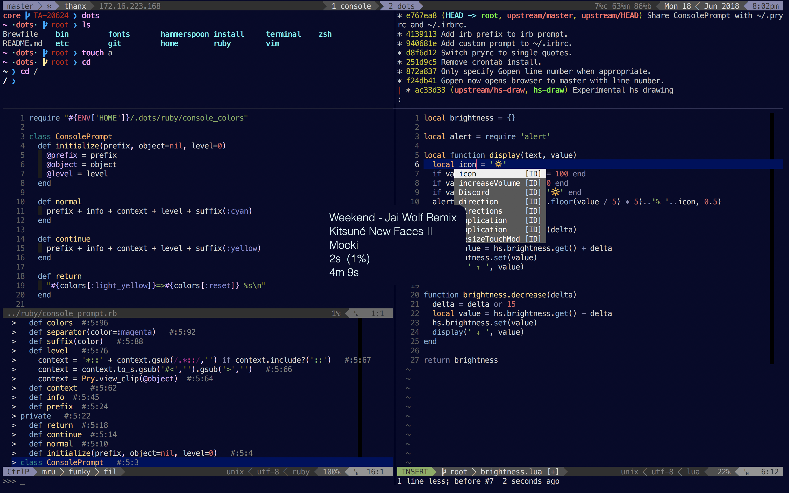

# Dots

> Obsessively curated dotfiles.

Managed by a robust, extensible Go CLI.

* * *

## Notice

Warning: This install script destructively installs configuration and various
tools onto your system. It does not backup existing configuration. Run at your
own risk.

## Install

    GO111MODULE=off go get github.com/drn/dots
    dots install all

## Dependencies

* [Homebrew](https://brew.sh/)
* [Go](https://golang.org/)
  * Installed via homebrew (`brew install go`)
  * `export GOPATH=$HOME/go`
  * `export PATH=$GOPATH/bin:$PATH`

## Commands

Top-level commands:

    ❯ dots

    The dots CLI manages your development environment dependencies

    Usage:
      dots [flags]
      dots [command]

    Available Commands:
      clean       Cleans legacy configuration
      docker      Docker command aliases
      doctor      Runs system diagnostics
      help        Help about any command
      install     Installs configuration
      spinner     Runs simple CLI spinners
      update      Updates configuration

    Flags:
      -h, --help   help for dots

    Use "dots [command] --help" for more information about a command.

Install commands:

    ❯ dots install --help

    Installs configuration

    Usage:
      dots install [flags]
      dots install [command]

    Available Commands:
      all         Runs all install scripts
      bin         Installs ~/bin/* commands
      fonts       Installs fonts
      git         Installs git extensions
      hammerspoon Installs hammerspoon configuration
      home        Installs ~/.* config files
      homebrew    Installs Homebrew dependencies
      languages   Installs asdf & languages
      npm         Installs npm packages
      osx         Installs OSX configuration
      vim         Installs vim config
      zsh         Installs zsh config files

    Flags:
      -h, --help   help for install

    Use "dots install [command] --help" for more information about a command.

## License

This project is licensed under the [MIT License](LICENSE.md)
