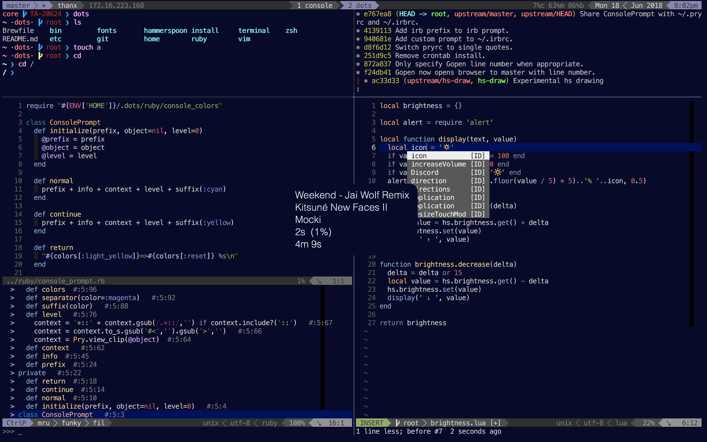

<p align="center">
  
</p>

# Dots

> Obsessively curated dotfiles and agentic skills managed by a robust, extensible Go CLI.

[](https://github.com/drn/dots/actions?query=branch%3Amaster)
[](https://goreportcard.com/report/github.com/drn/dots)
[](https://codeclimate.com/github/drn/dots/maintainability)



## Overview

Dots is a development environment management system built in Go. It provides a CLI for installing, updating, and managing your entire macOS development configuration — shell, editors, languages, system preferences, custom utilities, and a library of reusable [agent skills](https://agentskills.io) for Claude Code and Codex.

## System Requirements

- macOS
- [Homebrew](https://brew.sh/)
- [Go](https://golang.org/) 1.21+

## Installation

```bash
# Install Homebrew and Go if needed
brew install go

# Clone and install
git clone https://github.com/drn/dots ~/.dots
cd ~/.dots
go install ./...
dots install all
```

> **Warning**: Installation overwrites existing configuration files without backups. Back up your dotfiles first.

## Usage

```bash
dots                     # Show help and available commands
dots install all         # Install all components
dots install <component> # Install specific component
dots update              # Update configuration, plugins, and packages
dots doctor              # Run system diagnostics
dots clean               # Clean legacy configuration
dots docker stop-all     # Stop all Docker containers
```

### Components

| Component | What it installs |
|-----------|------------------|
| `agents` | Agent skills, custom agents, hooks, and status line (symlinks `agents/skills/` → `~/.claude/skills/` + `~/.agents/skills/`, `agents/custom/` → `~/.claude/agents/`, registers SessionStart/SessionEnd/PostToolUse hooks and status line in `~/.claude/settings.json`) |
| `bin` | Custom shell scripts and Go utilities to `~/bin` |
| `git` | `.gitconfig`, `.gitignore_global`, git extensions |
| `home` | Dotfiles symlinked to `~/` (`.zshrc`, `.vimrc`, `.tmux.conf`, `.gitconfig`, etc.) |
| `zsh` | ZSH configuration, zinit plugin manager, tmux plugin manager |
| `fonts` | Developer fonts via Homebrew Cask |
| `homebrew` | System packages from `Brewfile` (100+ formulae and casks) |
| `npm` | Global Node.js packages |
| `languages` | asdf version manager with Ruby, Python, Go, Node.js, Terraform |
| `vim` | Vim/Neovim configuration with vim-plug and plugins |
| `hammerspoon` | Lua-based window management and macOS automation |
| `osx` | macOS system preferences and defaults |
| `pi` | pi.dev coding agent CLI + config (installs `pi` via `curl pi.dev/install.sh`, symlinks `pi/agent/models.json` → `~/.pi/agent/models.json`, and seeds `defaultProvider`/`defaultModel` for Ollama qwen3:32b in `~/.pi/agent/settings.json`; `auth.json` and `sessions/` stay local) |

## Agent Skills

Dots includes 68 reusable slash-command skills for AI coding agents, following the [Agent Skills](https://agentskills.io) open standard. Each skill lives in `agents/skills/<name>/SKILL.md` and is available as `/<name>` in Claude Code after running `dots install agents`.

| Skill | Description |
|-------|-------------|
| `/test` | Intelligent test runner that targets changed code and identifies coverage gaps |
| `/pr` | Open a PR, wait for CI, fix failures, address review comments |
| `/address-comments` | Walk every unresolved review thread on a PR — triage, reply with rationale, fix if warranted, and resolve |
| `/review` | Code review panel for current branch changes |
| `/deploy` | Deploy master to production with version tags |
| `/merge` | Merge current branch to master via GitHub PR |
| `/debug` | Multi-agent competing hypotheses debugging |
| `/dev` | Multi-agent iterative development with parallel testing and code review |
| `/orchestrate` | Launch a dynamic Workflow: Fable plans and orchestrates, Sonnet and Opus implement |
| `/explore` | Multi-agent parallel research with peer-challenged synthesis |
| `/ci-investigate` | Investigate flaky CI failures across workflow runs |
| `/changelog` | Generate changelog from recent commits |
| `/combine-prs` | Compare two competing PRs and combine the best parts into one branch |
| `/release` | Release automation |
| `/bisect` | Automated git bisect |
| `/migrate` | Multi-agent codebase migration with module ownership |
| `/polish` | Code quality audit and refactoring |
| `/guard` | Pre-commit safety check for secrets and security antipatterns |
| `/scaffold` | Bootstrap new files matching existing repo conventions |
| `/deps` | Audit outdated dependencies and upgrade with test verification |
| `/spike` | Time-boxed technical investigation with structured findings |
| `/plan` | Generate an implementation plan from a PRD, spike, or spec |
| `/contest` | Competing implementations with judge evaluation |
| `/write-skill` | Create or improve a skill with best practices |
| `/screenshot` | View recent screenshots from `~/Downloads` |
| `/handoff` | Generate handoff prompt for another agent thread |
| `/standup` | Daily standup summary from git activity |
| `/pdf` | Export conversation content to styled PDF |
| `/knowledge` | Initialize or update a project knowledge base |
| `/dream` | Ingest meetings + session captures into the inbox, synthesize raw notes into existing topical docs, and audit KB hygiene — frontmatter, sizing, naming |
| `/retro` | Structured retrospective or post-incident review |
| `/logo` | Logo generation |
| `/slides` | Build a self-contained HTML presentation deck from talking points or a doc, with keyboard, tap, and swipe navigation |
| `/markdown-preview` | Render a Markdown file to GitHub-flavored HTML via `gh api /markdown` and open a styled local preview (light + dark) |
| `/improve` | Improve skills, capture context and knowledge |
| `/rereview` | Re-review with fresh eyes, zero regressions |
| `/rereview-loop` | Run `/rereview`, fix the findings, and loop until reviewers approve clean |
| `/devils-advocate` | Contrarian review perspective |
| `/perf` | Performance analysis |
| `/prune` | Branch cleanup |
| `/rebase` | Rebase automation |
| `/squash` | Squash all branch commits into one and update open PRs |
| `/prioritize` | RICE-scored backlog prioritization for sprint planning |
| `/equip` | Analyze a spec or codebase to identify missing skills and agents, then write them |
| `/cross-agent` | Set up cross-agent skill infrastructure for multi-agent compatibility |
| `/loop` | Run a prompt on a recurring interval for polling, monitoring, and babysitting |
| `/skill-usage` | Show skill usage statistics, charts, and suggestions for pruning unused skills |
| `/wrapup` | End-of-session checklist that detects loose ends and routes to follow-up skills |
| `/complete` | Mark the current Argus task's workflow status as complete via the `argus` MCP tool |
| `/archive` | Archive the current Argus task at session end via the `argus` MCP tool |

Skills use YAML frontmatter for metadata and dynamic context injection via shell commands. Some skills delegate to standalone bash scripts in `agents/skills/<name>/scripts/`. See `/write-skill` for the full authoring guide.

### Custom Agents

Dots also ships 3 reusable custom agent definitions in `agents/custom/`. These are specialized agent types that skills can spawn via the `subagent_type` parameter:

| Agent | Purpose |
|-------|---------|
| `code-analyst` | Code quality analysis across structure, design, and security dimensions |
| `investigator` | Evidence-based debugging with hypothesis-driven exploration |
| `verifier` | Test runner and implementation evaluator for regression checking |

Run `dots install agents` to symlink them to `~/.claude/agents/`.

## Project Structure

```
~/.dots/
├── main.go                    # Entry point → cli/commands.Execute()
├── go.mod                     # Go module (1.21)
├── Brewfile                   # Homebrew package manifest
│
├── cli/                       # CLI framework (Cobra)
│   ├── commands/              # Top-level commands
│   │   ├── root.go            # Command setup, global flags
│   │   ├── install.go         # Install orchestration
│   │   └── install/           # Component installers (12 files)
│   ├── is/                    # Boolean helpers (File, Command, Tmux, Osx)
│   ├── link/                  # Symlink/hardlink creation
│   └── git/, config/, tmux/   # Supporting utilities
│
├── pkg/                       # Shared packages
│   ├── log/                   # Colored logging (Action, Info, Success, Error)
│   ├── run/                   # Command execution (Verbose, Silent, Capture)
│   ├── path/                  # Path helpers (FromDots, FromHome)
│   └── cache/                 # File-based caching with TTL
│
├── cmd/                       # 23 standalone Go utilities
│   ├── git-ancestor/          # Common ancestor between branches
│   ├── git-canonical-branch/  # Canonical branch name
│   ├── git-killme/            # Delete branch and switch to master
│   ├── git-masterme/          # Rebase onto master
│   ├── git-rebase-master/     # Interactive rebase onto master
│   ├── git-reset-hard-master/ # Hard reset to master
│   ├── battery-percent/       # Battery percentage
│   ├── battery-state/         # Charging state
│   ├── cpu/                   # CPU usage
│   ├── ip/                    # IP utilities (external, local, home)
│   ├── router/, ssid/, gps/   # Network info
│   ├── spotify/               # Spotify control
│   ├── weather/               # Weather data
│   ├── tmux-status/           # Tmux status bar components
│   ├── search-github/         # GitHub search
│   ├── home-scp/              # SCP helper
│   ├── slack/                  # Slack read-only client
│   ├── gmail/                  # Gmail read-only client
│   └── tts/                    # Text-to-speech via OpenAI API
│
├── bin/                       # 35 shell scripts installed to ~/bin
├── home/                      # Dotfiles symlinked to ~/
├── zsh/                       # ZSH configuration (aliases, plugins, prompt, etc.)
├── vim/                       # Vim/Neovim configuration
├── git/                       # Git extensions and hooks
├── hammerspoon/               # Lua automation scripts (with tests)
├── fonts/                     # Developer fonts
├── pi/                        # pi.dev coding agent config (models.json only)
│
├── agents/                    # Agent configuration
│   ├── skills/                # 68 reusable skills (SKILL.md per skill)
│   └── custom/                # 3 custom agent types (.md per agent)
│       └── tests/             # Skill test suite
│
└── openspec/                  # Change proposal system
```

## Development

```bash
go install ./...                              # Build all binaries
go test ./...                                 # Run tests
revive -set_exit_status ./...                 # Lint
luajit hammerspoon/test.lua                   # Hammerspoon tests
bash .github/skill-tests/run_all.sh           # Skill script tests
```

### Spec-Driven Development (OpenSpec)

Behavioral changes (new commands/components, changed install behavior, new skills/agents/hooks,
altered conventions) are routed through `openspec/` before coding: create a change folder with a
proposal, spec deltas, and tasks; get approval; implement; then archive into the base specs **in
the same PR**. Specs are local design docs only — never wired into CI. See the *Spec-Driven
Development* section in `AGENTS.md` and the full guide in `openspec/AGENTS.md`.

```bash
openspec list                                 # Active changes
openspec validate <change-id> --strict        # Validate a proposal
openspec archive <change-id> --yes            # Apply deltas to base specs
```

### Adding Components

1. Add to the `commands` slice in `cli/commands/install.go`
2. Create installer in `cli/commands/install/<component>.go`
3. Use `exec()` helper for error handling and `pkg/run` for command execution

### Adding Utilities

1. Create `cmd/<name>/root.go` using Cobra
2. Build with `go install ./...`

### Adding Skills

1. Create `agents/skills/<name>/SKILL.md` with YAML frontmatter
2. See `agents/skills/write-skill/SKILL.md` for the authoring guide
3. Run `dots install agents` to symlink into `~/.claude/skills/`

## CI/CD

GitHub Actions runs on every push to master and all PRs:

- **Build** and **test** Go code
- **Vet** and **staticcheck** for correctness
- **Revive** for linting
- **Hammerspoon tests** via LuaJIT
- **Skill lint** — validates SKILL.md syntax
- **Skill script tests** — runs the skill test suite
- **Agent config lint** — validates configuration via [agnix](https://github.com/anthropics/agnix)

## Environment Variables

| Variable | Description |
|----------|-------------|
| `DOTS` | Override dots directory location (default: `~/.dots`) |
| `GOPATH` | Go workspace |
| `GOBIN` | Go binary installation directory |

## License

[MIT License](LICENSE.md)