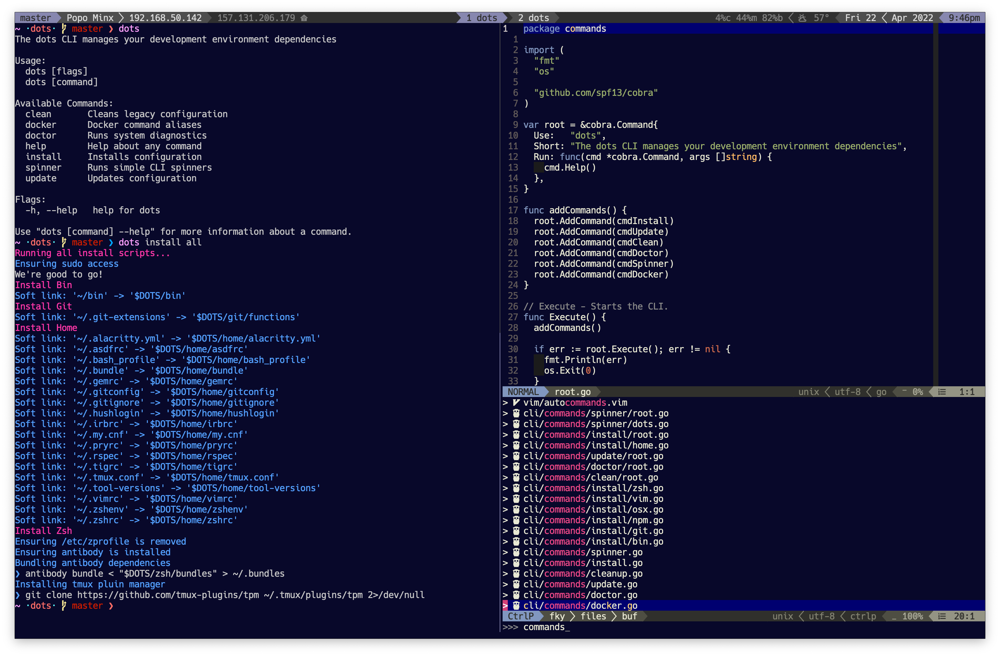

# Dots

> Obsessively curated dotfiles.

* * *

## TL;DR

Warning: This install script destructively installs configuration and various
tools onto your system. It does not backup existing configuration. Run at your
own risk.

Quick Installation

    curl -s https://raw.githubusercontent.com/drn/dots/master/install/all.sh | sh

## Install

**Porting to Golang-based CLI - Work In Progress**

Ensure homebrew is installed:

    if ! hash brew 2>/dev/null; then
      /usr/bin/ruby -e "$(curl -fsSL https://raw.githubusercontent.com/Homebrew/install/master/install)"
    fi

Ensure golang is installed:

    brew install go
    # add the following to your ~/.profile
    export GOPATH=$HOME/go
    export PATH=$GOPATH/bin:$PATH

Install dots CLI:

    go get github.com/drn/dots

Install dependencies:

    dots install

## Overview

These dotfiles are an ever-changing document of my development environment
configuration. I use these dotfiles and included installation scripts to
synchronize my setup across various machines.

The above 'quick installation' script runs through the setup, configuration,
and installation of the following sections:

  * dotfiles - basic `~/.*` config files
  * vim - vim
  * zsh - antibody
  * git - custom functions, templates, hooks
  * utilities - terminal utilities
  * bin - custom scripts on the `$PATH`
  * fonts - development fonts
  * osx - os x system config

### Dots

All files in the [home](https://github.com/drn/dots/tree/master/home)
directory are symlinked to `$HOME` with a `.` prefix.

### VIM

  * The [vimrc](https://github.com/drn/dots/blob/master/home/vimrc)
    contains all non-plugin related mappings, configurations, and functions.
    This is auto-symlinked with the other `~/.*` files
  * The [Vimfile](https://github.com/drn/dots/blob/master/Vimfile)
    is the canonical listing of the included 50+ vim plugins
  * [Plugin settings](https://github.com/drn/dotfiles/tree/master/vim/plugin/settings)
    are symlinked into the appropriate `~/.vim/*` location
  * Binaries for installed plugins are automatically compiled

### ZSH

The default shell is overridden and set to Homebrew installed ZSH.

  * [oh-my-zsh](https://github.com/robbyrussell/oh-my-zsh) - zsh configuration management framework
  * [custom](https://github.com/drn/dots/tree/master/zsh) shell prompt,
    aliases, plugins, completions are configured

### Git

  * Default config files (`.gitconfig`, `.gitignore`)
  * Custom [git extensions](https://github.com/drn/dots/tree/master/git/functions)
    tailored to my workflow

### Utils

Terminal utilities and system tools are installed via the
[util script](https://github.com/drn/dots/blob/master/install/utils.sh)

  * The [Brewfile](https://github.com/drn/dots/blob/master/Brewfile)
    is the canonical listing of Homebrew installed utilities
  * Other utilities installed via other sources include:
    * [pow.cx](http://pow.cx) - zero-config rack server
    * [jira-cli](http://rubygems.org/gems/jira-cli) - JIRA workflow management
      CLI

### Fonts

  * Menlo for Powerline

### OS X

[OS X Configuration](https://github.com/drn/dots/blob/master/install/osx.sh)
including:

  * faster key press
  * disable sleep image
  * disable spotlight
  * etc.

## License

This project is licensed under the [MIT License](http://opensource.org/licenses/MIT)
